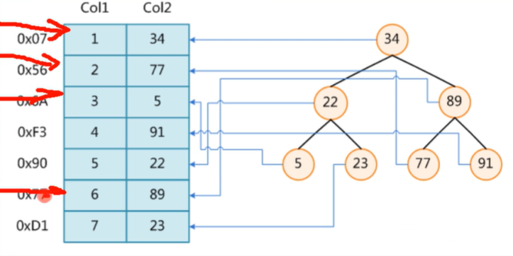
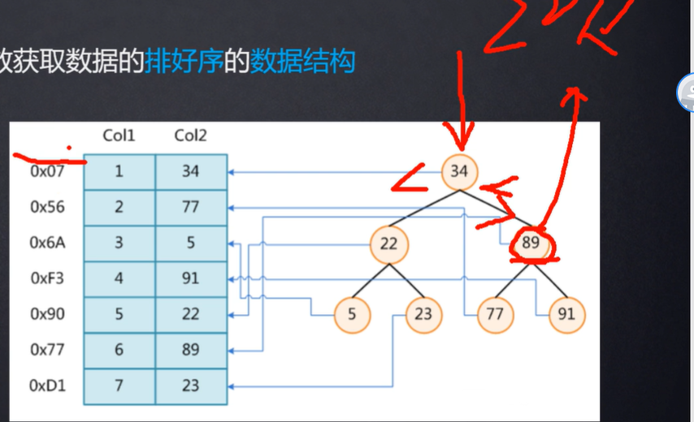
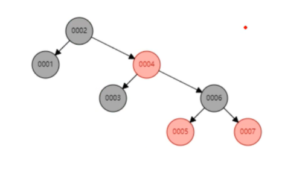
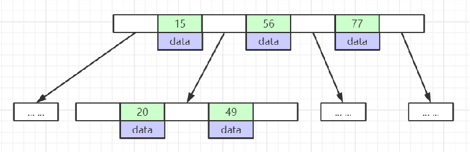
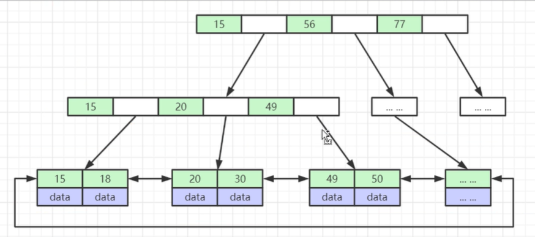
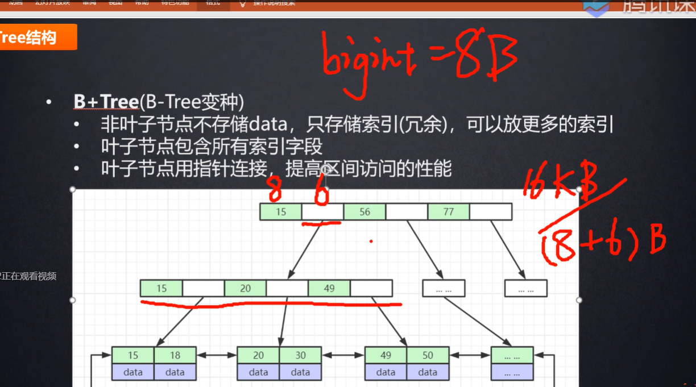

什么是索引？ 书的目录？快速找到某一页

索引是帮助mysql高效获取数据的排好序的数据结构

有哪些数据结构

二叉树、红黑树、hash表 、 B树

select* from t where t.col2 = 89

如果没有索引一行一行查找

数据存在磁盘上，数据存在磁盘上，磁盘上随机分布的，不一定是挨在一起的，可能今天数据存在不同的磁道上，每次磁盘IO，需要寻道，然后读写磁头去读对应的数据，这期间也是有时间消耗的。而每拿取一行记录都要和磁盘做一次交互，发生一次磁盘IO。基于此索引的必要性就可以知道了。

寻道时间：磁头从开始移动到数据所在磁道所需要的时间，寻道时间越短，I/O操作越快，目前磁盘的平均寻道时间一般在3－15ms，一般都在10ms左右。*

*旋转延迟：盘片旋转将请求数据所在扇区移至读写磁头下方所需要的时间，旋转延迟取决于磁盘转速。普通硬盘一般都是7200rpm，慢的5400rpm。*

*数据传输时间：完成传输所请求的数据所需要的时间。*
*小结一下：从上面的指标来看、其实最重要的、或者说、我们最关心的应该只有两个：寻道时间；旋转延迟。*

 *固态硬盘不用磁头，寻道时间几乎为0。* 

如果是二叉树

左边小于父元素，右边大于父元素

两次查找，mysql并没有用二叉树，例如这种COL1这种逐行递增的，建二叉树索引的话，就会变成一个链表，导致查询效率还是比较低。如果递增的话永远在右边，变成了一条链表。这种情况没有太大提升。

如果是红黑树，也叫二叉平衡树。会对二叉树做平衡

mysql不用红黑树，因为实际数据量比较大的话，红黑树的高度比较高，查找的效率与树的高度是成反比的。

如果是B树

****

每一页上存索引和数据信息（key，value），data是数据的磁盘文件地址，

B+树就是B树的变种

B+树，非叶子节点不存储data，只存储冗余索引，这样每一页就可以存更多的索引。

叶子节点包含所有的索引字段，叶子节点就是磁盘页，从左到右是排好序的

B树是叶子节点之间是没有指针的，而B+树叶子节点用指针连接，这样就提高了区间访问的性能 ，每一页上都是排好序的（非常重要）

mysql数据页16KB    

验证sql: show global status like 'Innodb_page_size'; 这个值是可以改的但是不推荐改，mysql推荐的最优值

如果我要寻找30，先从根节点开始查找，会把B+树根节点所有的元素load到RAM中，然后通过折半或者二分算法找到三十这个元素位于15到56之间，然后把第二级的页加载到内存中，然后继续二分，去叶子节点，找到对应的索引及数据

这里面最耗时的就是把数据load到内存中，在内存中比对的速度可以忽略不计，为什么不把所有的节点都放到根节点， 因为如果数据量特别大的话，加载到内存中取比对，速度也是快不起来的。

为什么是16KB

如果按照主键索引是bigint 8字节算，地址大约占6字节，16kb/14B，就可以推算出大概能存1170个索引

