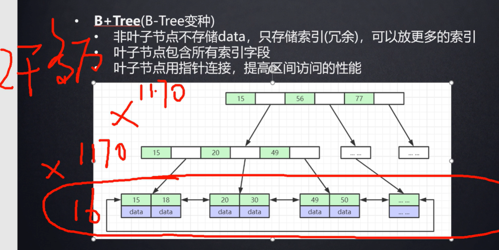
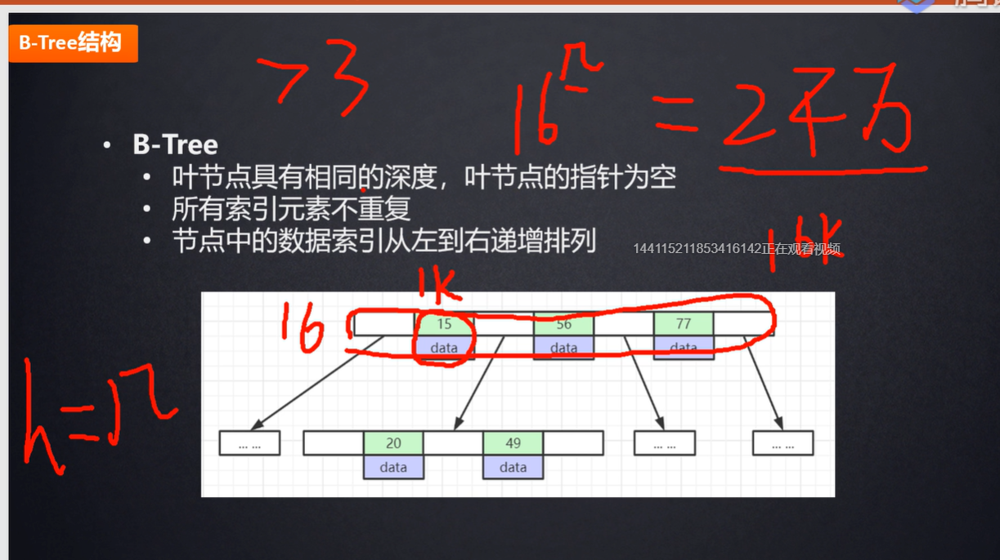
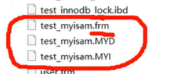
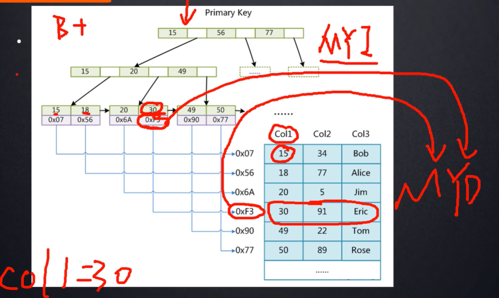
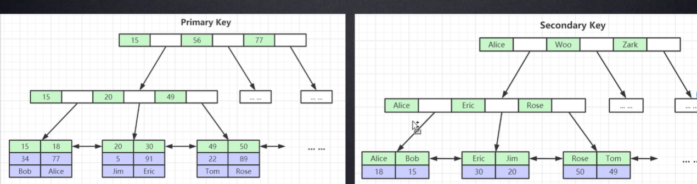
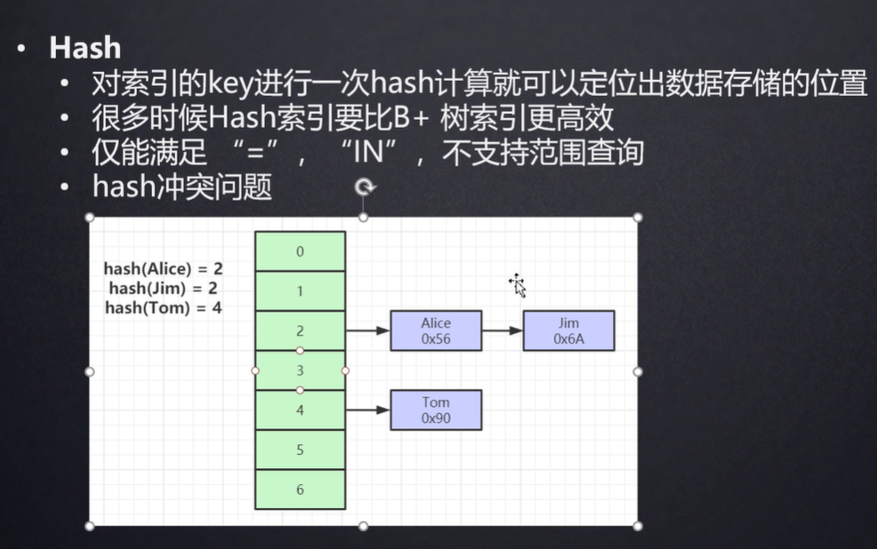
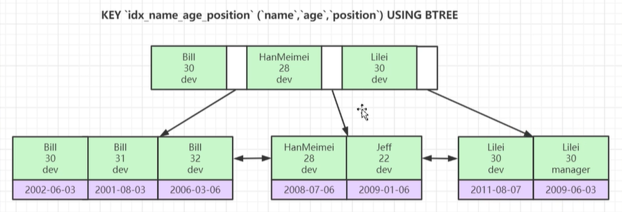

什么是索引？ 书的目录？快速找到某一页

索引是帮助mysql高效获取数据的排好序的数据结构

有哪些数据结构

二叉树、红黑树、hash表 、 B树

select* from t where t.col2 = 89

如果没有索引一行一行查找

数据存在磁盘上，数据存在磁盘上，磁盘上随机分布的，不一定是挨在一起的，可能今天数据存在不同的磁道上，每次磁盘IO，需要寻道，然后读写磁头去读对应的数据，这期间也是有时间消耗的。而每拿取一行记录都要和磁盘做一次交互，发生一次磁盘IO。基于此索引的必要性就可以知道了。

寻道时间：磁头从开始移动到数据所在磁道所需要的时间，寻道时间越短，I/O操作越快，目前磁盘的平均寻道时间一般在3－15ms，一般都在10ms左右。*

*旋转延迟：盘片旋转将请求数据所在扇区移至读写磁头下方所需要的时间，旋转延迟取决于磁盘转速。普通硬盘一般都是7200rpm，慢的5400rpm。*

*数据传输时间：完成传输所请求的数据所需要的时间。*
*小结一下：从上面的指标来看、其实最重要的、或者说、我们最关心的应该只有两个：寻道时间；旋转延迟。*

 *固态硬盘不用磁头，寻道时间几乎为0。* 

如果是二叉树

左边小于父元素，右边大于父元素

两次查找，mysql并没有用二叉树，例如这种COL1这种逐行递增的，建二叉树索引的话，就会变成一个链表，导致查询效率还是比较低。如果递增的话永远在右边，变成了一条链表。这种情况没有太大提升。

如果是红黑树，也叫二叉平衡树。会对二叉树做平衡

mysql不用红黑树，因为实际数据量比较大的话，红黑树的高度比较高，查找的效率与树的高度是成反比的。

如果是B树

****

每一页上存索引和数据信息（key，value），data是数据的磁盘文件地址，

B+树就是B树的变种

B+树，非叶子节点不存储data，只存储冗余索引，这样每一页就可以存更多的索引。

叶子节点包含所有的索引字段，叶子节点就是磁盘页，从左到右是排好序的

B树是叶子节点之间是没有指针的，而B+树叶子节点用指针连接，这样就提高了区间访问的性能 ，每一页上都是排好序的（非常重要）

mysql数据页16KB    

验证sql: show global status like 'Innodb_page_size'; 这个值是可以改的但是不推荐改，mysql推荐的最优值

如果我要寻找30，先从根节点开始查找，会把B+树根节点所有的元素load到RAM中，然后通过折半或者二分算法找到三十这个元素位于15到56之间，然后把第二级的页加载到内存中，然后继续二分，去叶子节点，找到对应的索引及数据

这里面最耗时的就是把数据load到内存中，在内存中比对的速度可以忽略不计，为什么不把所有的节点都放到根节点， 因为如果数据量特别大的话，加载到内存中取比对，速度也是快不起来的。

为什么是16KB

如果按照主键索引是bigint 8字节算，地址大约占6字节，16kb/14B，就可以推算出大概能存1170个索引

两千多万数据，树的高度竟然为3。也就是说只要经过三次的磁盘IO就可查找到元素，这个效率和全表扫描相比提升了几个数量级。如果超过两千多万，互联网公司大概率会分库分表，如果继续单表，树的高度会继续增加。在增加一层高度，数据量变得更高。

mysql把根节点常驻内存，甚至高版本的会把所有的非叶子节点都放到内存中。

为什么不用b树，用b+树，因为树的高度是由非叶子节点中能放多少个索引元素决定的，能放更多的索引元素，树的高度就越低，而且b+树比b树多了指针

yum安装的mysql 默认data目录 为：cd /var/lib/mysql

存储引擎：

一、myisam：

myisam存储引擎对应mysql data文件夹下有三个文件，myisam索引文件和数据文件是分离的（非聚集索引）

分别是.frm .MYD .MYI文件

frm文件是framework框架的意思，里面存放的是表结构的相关信息

MYD文件是myisam data的缩写，数据文件，整张表里的数据都存在这个文件里面

MYI文件是myisam index的缩写，如果有索引，会放在这个里面

myisam查询数据的过程，先找到b+树叶子节点对应的索引及data，然后这时候的data存的是数据的地址，然后根据这个地址去MYD文件里面找。

二、Innodb

innodb是聚集索引

表数据文件本身就是按B+树组织的一个索引结构的文件

聚集索引的含义就是叶节点包含了完整的数据记录

为什么建议Innodb表必须建主键，并且推荐使用整形的自增主键？

为什么要主键：因为mysql的资源是非常宝贵的，如果有主键的话，主键自带主键索引，直接就可以形成B+树，如果没有主键，就会从左到右每一列去找，找到一列不相等的列，作为主键，如果没有不相等的列，那么mysql就会帮我们生成一列隐藏列，rowid，并且这列rowid是不相等的。这就是为什么推荐建表的时候设定主键，可以节省mysql的资源消耗。

为什么要整形：因为查询的时候方便比大小，如果是uuid这种长字符串的话，需要用每一位的ascl码去比大小。速度肯定不如整形来的快。而且整形占用的空间也比字符串要少。生产环境下可以节约固态硬盘的空间。

为什么要自增的主键：如果不是自增的话，比如插入123456798，会使节点分裂，然后树自身会平衡。如果自增的话，节点的数量满了，会再开辟一个节点。

为什么非主键索引结构叶子节点存储的是主键值？（一致性和节省存储空间）

一致性：如果非主键索引，叶子节点存的是数据的话，那么当数据发生DML更新的时候主键索引和非主键索引的B+树都要同步更新，会带来消耗

节省存储空间：本来就是空间换时间，把数据存到里面会增加存储空间

frm文件还是表结构

ibd是索引和数据组成的b+树

hash结构的索引：

=查询效率高，但是不支持范围查询，所以基本不用hash索引

联合索引数据存储结构

下图这是联合主键索引

先比较name，在比较age，在比较position

