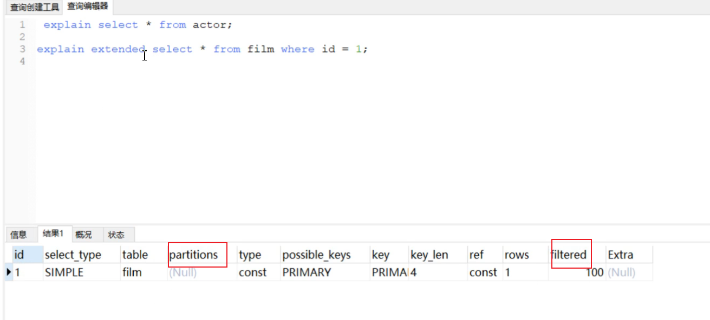
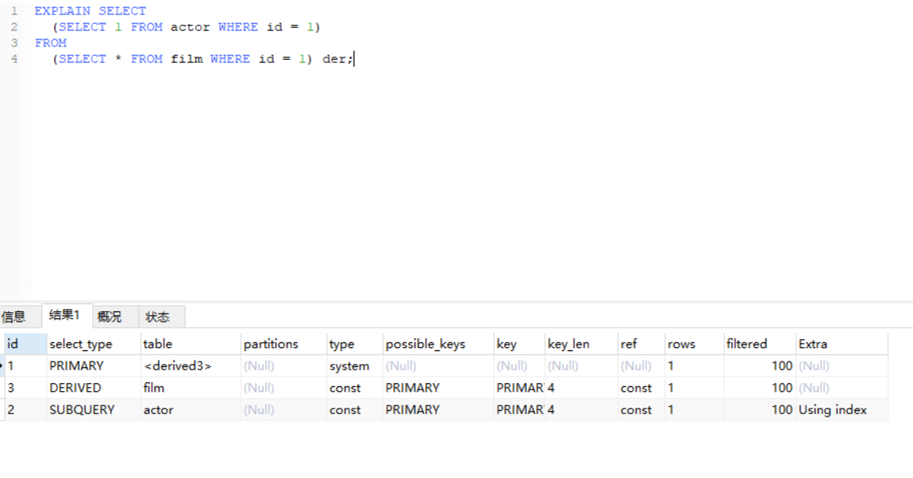
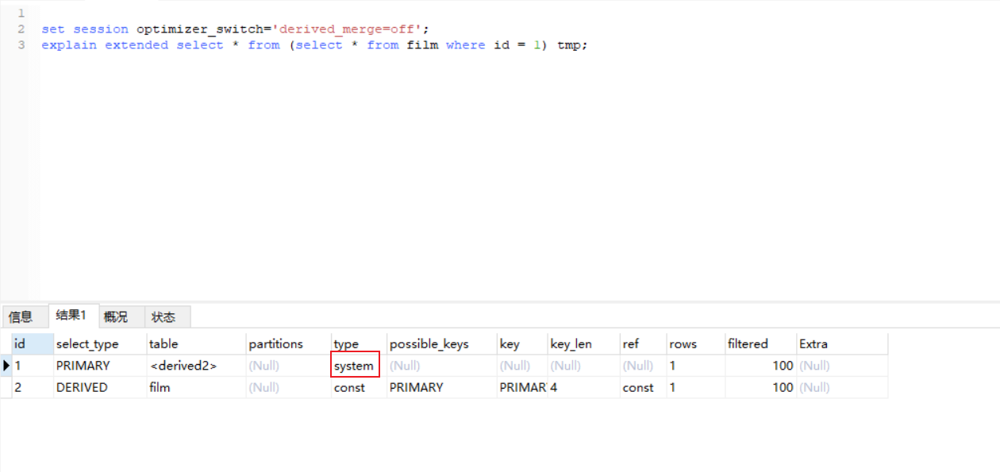
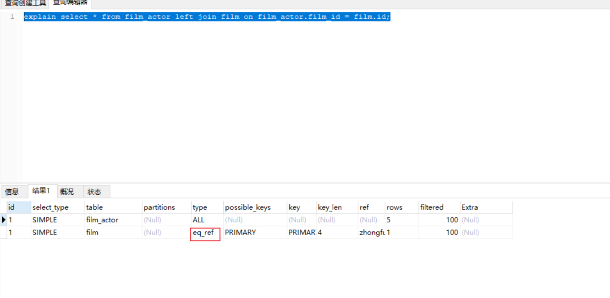

### 一、建表sql

```sql
DROP TABLE IF EXISTS actor;
CREATE TABLE actor (
  id int(11) NOT NULL,
  name varchar(45) DEFAULT NULL,
  update_time datetime DEFAULT NULL,
  PRIMARY KEY (id)
) ENGINE=InnoDB DEFAULT CHARSET=utf8;

INSERT INTO actor VALUES ('1', '徐凤年', '2021-12-28 13:46:10');
INSERT INTO actor VALUES ('2', '李淳罡', '2021-12-28 13:46:10');
INSERT INTO actor VALUES ('3', '李当心', '2021-12-28 13:46:10');
INSERT INTO actor VALUES ('4', '拓跋菩萨', '2021-12-28 13:46:10');
INSERT INTO actor VALUES ('5', '段誉', '2021-12-28 13:49:59');


DROP TABLE IF EXISTS film;
CREATE TABLE film (
  id int(11) NOT NULL AUTO_INCREMENT,
  name varchar(10) DEFAULT NULL,
  PRIMARY KEY (id),
  KEY idx_name (name)
) ENGINE=InnoDB AUTO_INCREMENT=3 DEFAULT CHARSET=utf8;

INSERT INTO film VALUES ('2', '天龙八部');
INSERT INTO film VALUES ('1', '雪中悍刀行');


DROP TABLE IF EXISTS film_actor;
CREATE TABLE film_actor (
  id int(11) NOT NULL,
  film_id int(11) NOT NULL,
  actor_id int(11) NOT NULL,
  remark varchar(255) DEFAULT NULL,
  PRIMARY KEY (id),
  KEY idx_film_actor_id (film_id,actor_id)
) ENGINE=InnoDB DEFAULT CHARSET=utf8;

INSERT INTO film_actor VALUES ('1', '1', '1', 'hello');
INSERT INTO film_actor VALUES ('2', '1', '2', 'hello');
INSERT INTO film_actor VALUES ('3', '1', '3', 'hello');
INSERT INTO film_actor VALUES ('4', '1', '4', 'hello');
INSERT INTO film_actor VALUES ('5', '2', '5', 'hello');
```

### 二、explain执行计划

#### （一）explain两个变种

  1、**explain extended** explain 5.7以上版本有partitions和filtered字段，如果以下版本想显示这两个字段需要加上 extended 如下图



filtered：就是当前的查询结果，占总查询记录的百分比

2、 **explain partitions** 

相比 explain 多了个 partitions 字段，如果查询是基于分区表的话，会显示查询将访问的分

区。

不过mysql5.7及以后 废弃了上述写法explain partitions 和explain extended 直接 explain就自带了上述的分区信息 和过滤信息


#### （二） explain中的列 

```
set session optimizer_switch='derived_merge=off';       #关闭mysql5.7新特性对衍生表的合并优化
show warnings;                                          #查看mysql帮助优化的结果
```

##### 1.id列

id列的编号是 select 的序列号，有几个 select 就有几个id，并且id的顺序是按 select 出现的顺序增长的。

id列越大执行优先级越高，id相同则从上往下执行，id为NULL最后执行。

##### 2.select_type 

select_type 表示对应行是简单还是复杂的查询。

1）simple：简单查询。查询不包含子查询和union

2）primary：复杂查询中最外层的 select

3）subquery：包含在 select 中的子查询（不在 from 子句中）

4）derived：包含在 from 子句中的子查询。MySQL会将结果存放在一个临时表中，也称为派生表（derived的英文含义）

##### 3.table列

这一列表示 explain 的一行正在访问哪个表。

当 from 子句中有子查询时，table列是  格式，表示当前查询依赖 id=N 的查询，于是先执行 id=N 的查

询。 如下图所示先执行的就是id为3的查询



##### 4.type

这一列表示关联类型或访问类型，即MySQL决定如何查找表中的行，查找数据行记录的大概范围。

依次从最优到最差分别为：

```
system > const > eq_ref > ref > range > index > ALL
```

**NULL**：mysql能够在优化阶段分解查询语句，在执行阶段用不着再访问表或索引。例如：在索引列中选取最小值，可以单独查找索引来完成，不需要在执行时访问表

因为 索引是排好序的 那么就直接取了

例如：id是主键索引，并且是排好序的，不用再去访问表或索引，比如取id的最小值这种。

```sql
 explain select min(id) from film; 
```

**const, system：**mysql能对查询的某部分进行优化并将其转化成一个常量（可以看show warnings 的结果）。用于**primary key** 或 **unique key** 的所有列与**常数**比较时，所以表最多有一个匹配行，读取1次，速度比较快。system是const的特例，表里**只**有**一条数据**匹配时为system 

例如： 

```sql
explain extended select * from (select * from film where id = 1) tmp;
show warnings;
```



**eq_ref**：**primary key** 或 **unique key** 索引的所有部分被连接使用 ，最多只会返回一条符合条件的记录。这可能是在const 之外最好的联接类型了，简单的 select 查询不会出现这种 type。

```sql
explain select * from film_actor left join film on film_actor.film_id = film.id;
```



