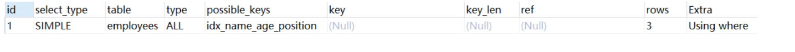
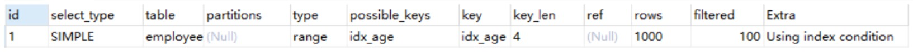
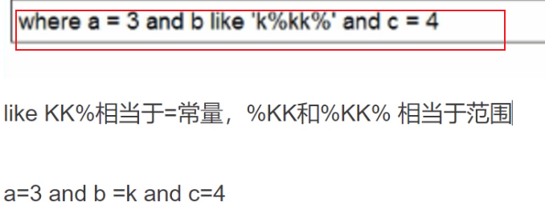

# 一、建表sql

```sql
DROP TABLE IF EXISTS actor;
CREATE TABLE actor (
  id int(11) NOT NULL,
  name varchar(45) DEFAULT NULL,
  update_time datetime DEFAULT NULL,
  PRIMARY KEY (id)
) ENGINE=InnoDB DEFAULT CHARSET=utf8;

INSERT INTO actor VALUES ('1', '徐凤年', '2021-12-28 13:46:10');
INSERT INTO actor VALUES ('2', '李淳罡', '2021-12-28 13:46:10');
INSERT INTO actor VALUES ('3', '李当心', '2021-12-28 13:46:10');
INSERT INTO actor VALUES ('4', '拓跋菩萨', '2021-12-28 13:46:10');
INSERT INTO actor VALUES ('5', '段誉', '2021-12-28 13:49:59');


DROP TABLE IF EXISTS film;
CREATE TABLE film (
  id int(11) NOT NULL AUTO_INCREMENT,
  name varchar(10) DEFAULT NULL,
  PRIMARY KEY (id),
  KEY idx_name (name)
) ENGINE=InnoDB AUTO_INCREMENT=3 DEFAULT CHARSET=utf8;

INSERT INTO film VALUES ('2', '天龙八部');
INSERT INTO film VALUES ('1', '雪中悍刀行');


DROP TABLE IF EXISTS film_actor;
CREATE TABLE film_actor (
  id int(11) NOT NULL,
  film_id int(11) NOT NULL,
  actor_id int(11) NOT NULL,
  remark varchar(255) DEFAULT NULL,
  PRIMARY KEY (id),
  KEY idx_film_actor_id (film_id,actor_id)
) ENGINE=InnoDB DEFAULT CHARSET=utf8;

INSERT INTO film_actor VALUES ('1', '1', '1', 'hello');
INSERT INTO film_actor VALUES ('2', '1', '2', 'hello');
INSERT INTO film_actor VALUES ('3', '1', '3', 'hello');
INSERT INTO film_actor VALUES ('4', '1', '4', 'hello');
INSERT INTO film_actor VALUES ('5', '2', '5', 'hello');
```

# 二、explain执行计划

## （一）explain两个变种

###   1、**explain extended** 

explain 5.7以上版本有partitions和filtered字段，如果以下版本想显示这两个字段需要加上 extended 如下图


filtered：就是当前的查询结果，占总查询记录的百分比

### 2、 **explain partitions** 

相比 explain 多了个 partitions 字段，如果查询是基于分区表的话，会显示查询将访问的分区。

不过mysql5.7及以后 废弃了上述写法explain partitions 和explain extended 直接 explain就自带了上述的分区信息和过滤信息


## （二） explain中的列 

```sql
set session optimizer_switch='derived_merge=off';       #关闭mysql5.7新特性对衍生表的合并优化
show warnings;                                          #查看mysql帮助优化的结果
```

### 1.id列

id列的编号是 select 的序列号，有几个 select 就有几个id，并且id的顺序是按 select 出现的顺序增长的。

id列越大执行优先级越高，id相同则从上往下执行，id为NULL最后执行。

### 2.select_type 

select_type 表示对应行是简单还是复杂的查询。

1）simple：简单查询。查询不包含子查询和union

2）primary：复杂查询中最外层的 select

3）subquery：包含在 select 中的子查询（不在 from 子句中）

4）derived：包含在 from 子句中的子查询。MySQL会将结果存放在一个临时表中，也称为派生表（derived的英文含义）

### 3.table列

这一列表示 explain 的一行正在访问哪个表。

当 from 子句中有子查询时，table列是  格式，表示当前查询依赖 id=N 的查询，于是先执行 id=N 的查

询。 如下图所示先执行的就是id为3的查询


### 4.type列

这一列表示关联类型或访问类型，即MySQL决定如何查找表中的行，查找数据行记录的大概范围。

依次从最优到最差分别为：

```sql
system > const > eq_ref > ref > range > index > ALL
```

#### **NULL**：

mysql能够在优化阶段分解查询语句，在执行阶段用不着再访问表或索引。例如：在索引列中选取最小值，可以单独查找索引来完成，不需要在执行时访问表

因为 索引是排好序的 那么就直接取了

例如：id是主键索引，并且是排好序的，不用再去访问表或索引，比如取id的最小值这种。

```sql
 explain select min(id) from film; 
```

**const, system：**mysql能对查询的某部分进行优化并将其转化成一个常量（可以看show warnings 的结果）。用于**primary key** 或 **unique key** 的所有列与**常数**比较时，所以表最多有一个匹配行，读取1次，速度比较快。system是const的特例，表里**只**有**一条数据**匹配时为system 

例如： 

```sql
explain extended select * from (select * from film where id = 1) tmp;
show warnings;
```


#### **eq_ref**：

**primary key** 或 **unique key** 索引的所有部分被连接使用 ，最多只会返回一条符合条件的记录。这可能是在const 之外最好的联接类型了，简单的 select 查询不会出现这种 type。主键或唯一键关联，eq_ref效率仅次于const。

```sql
explain select * from film_actor left join film on film_actor.film_id = film.id;
```


#### **ref：**

相比 **eq_ref**，不使用唯一索引，而是使用**普通索引**或者**唯一性索引的部分前缀**，索引要和某个值相比较，可能会找到多个符合条件的行。

1.简单 select 查询，name是普通索引（非唯一索引） 

```sql
explain select * from film where name = 'film1';     
```

  

2.关联表查询，idx_film_actor_id是film_id和actor_id的联合索引，这里使用到了film_actor的左边前缀film_id部分。

```sql
 explain select film_id from film left join film_actor on film.id = film_actor.film_id; 
```

               


#### **range：**

范围扫描通常出现在 in(), between ,> ,<, >= 等操作中。使用一个索引来检索给定范围的行。

```sql
 explain select * from actor where id > 1; 
```

 


#### **index：**

扫描全索引就能拿到结果，一般是扫描某个二级索引，这种扫描不会从索引树根节点开始快速查找，而是直接对二级索引的叶子节点遍历和扫描，速度还是比较慢的，这种查询一般为使用覆盖索引，二级索引一般比较小，所以这种通常比ALL快一些。要查询的字段在索引中就能查找出来，比如一张表里就只有name和id两个字段，同时做了name的索引，这时候通过二级索引就可以直接查出所要的结果。

```sql
explain select  * from  film;
```


二级索引的叶子节点数据量只有主键索引的值 而主键索引叶子节点存放的是这一行所有的数据


#### **ALL：**

即全表扫描，扫描你的聚簇索引的所有叶子节点。通常情况下这需要增加索引来进行优化了。

```sql
 explain select * from actor; 
```

  


### 5.possible_keys列

这一列显示查询可能使用哪些索引来查找。

explain 时可能出现 possible_keys 有列，而 key 显示 NULL 的情况，这种情况是因为表中数据不多，mysql认为索引对此查询帮助不大，选择了全表查询。

如果该列是NULL，则没有相关的索引。在这种情况下，可以通过检查 where 子句看是否可以创造一个适当的索引来提高查询性能，然后用 explain 查看效果。


### 6.key列

这一列显示mysql实际采用哪个索引来优化对该表的访问。

如果没有使用索引，则该列是 NULL。如果想强制mysql使用或忽视possible_keys列中的索引，在查询中使用 force index、ignore index。


### 7.key_len列

这一列显示了mysql在索引里使用的字节数，通过这个值可以算出具体使用了索引中的哪些列。

举例来说，film_actor的联合索引 idx_film_actor_id 由 film_id 和 actor_id 两个int列组成，并且每个int是4字节。通过结果中的key_len=4可推断出查询使用了第一个列：film_id列来执行索引查找。

```sql
 explain select * from film_actor where film_id = 2; 
```

  

key_len计算规则如下：

**字符串char(n)和varchar(n)**:

5.0.3以后版本中，n均代表字符数，而不是字节数，如果是utf-8，一个数字或字母占1个字节，一个汉字占3个字节

char(n)：如果存汉字长度就是 3n 字节

varchar(n)：如果存汉字则长度是 3n + 2 字节，加的2字节用来存储字符串长度，因为varchar是变长字符串

**数值类型:**

tinyint：1字节

smallint：2字节

int：4字节

bigint：8字节　　

**时间类型:**　

date：3字节

timestamp：4字节

datetime：8字节

**如果字段允许为 NULL，需要1字节记录是否为 NULL**

索引最大长度是768字节，当字符串过长时，mysql会做一个类似左前缀索引的处理，将前半部分的字符提取出来做索引。


### 8.ref列

 这一列显示了在key列记录的索引中，表查找值所用到的列或常量，常见的有：const（常量），字段名（例：film.id） 


### 9.rows列

这一列是mysql估计要读取并检测的行数，注意这个不是结果集里的行数。


### 10.Extra列

这一列展示的是额外信息。常见的重要值如下：

**（1）Using index：**使用**覆盖索引**

覆盖索引定义：mysql执行计划explain结果里的key有使用索引，如果**select后面查询的字段都可以从这个索引的树中获取**，这种情况一般可以说是用到了覆盖索引，extra里一般都有using index；覆盖索引一般针对的是辅助索引，**整个查询结果只通过辅助索引就能拿到结果**，不需要通过辅助索引树找到主键，再通过主键去主键索引树里获取其它字段值即查询的结果集在索引树里面全部包括不需要回表去找。

```sql
 explain select film_id from film_actor where film_id = 1; 
```

  


**（2） Using where：**使用 where 语句来处理结果，并且查询的列未被索引覆盖 

```sql
 explain select * from actor where name = 'a'; 
```

  


**（3）Using index condition：**查询的列不完全被索引覆盖，where条件中是一个前导列的范围

```sql
 explain select * from film_actor where film_id > 1; 
```

  

 

**（4）Using temporary：**mysql需要创建一张临时表来处理查询。出现这种情况一般是要进行优化的，首先是想到用索引来优化。 

**例1：**

actor.name没有索引，此时创建了张临时表来distinct 

```sql
 explain select distinct name from actor; 
```

  

**例2：**

 film.name建立了idx_name索引，此时查询时extra是using index（即使用覆盖索引）,没有用临时表 

```sql
 explain select distinct name from film; 
```

  

即总结如下（覆盖索引 扫描二级索引 **边扫描边去重**）所以说在扫描索引树的过程中结果集就出来了

没有索引的话 那就全部拿出来放入内存中然后建立临时表去重


**（5） Using filesort：**将用**外部排序**而不是**索引排序**，**数据较小时从内存排序，否则需要在磁盘完成排序**。这种情况下一般也是要考虑使用索引来优化的。 

 actor.name未创建索引，会浏览actor整个表，保存排序关键字name和对应的id，然后排序name并检索行记录 

```sql
 explain select * from actor order by name; 
```

  

 film.name建立了idx_name索引,此时查询时extra是using index 

```sql
 explain select * from film order by name; 
```

  

**（6） Select tables optimized away：**  使用某些聚合函数（比如 max、min）来访问存在索引的某个字段值

 因为 **索引是排好序**的所以直接取了 

```sql
 explain select min(id) from film; 
```

  


# 三、实践

## 建表sql

```sql
CREATE TABLE `employees` (
	`id` INT(11) NOT NULL AUTO_INCREMENT,
	`name` VARCHAR(24) NOT NULL DEFAULT '' COMMENT '姓名',
	`age` INT(11) NOT NULL DEFAULT '0' COMMENT '年龄',
	`position` VARCHAR(20) NOT NULL DEFAULT '' COMMENT '职位',
	`hire_time` TIMESTAMP NOT NULL DEFAULT CURRENT_TIMESTAMP COMMENT '入职时间',
	PRIMARY KEY (`id`),
	KEY `idx_name_age_position` USING BTREE (`name`, `age`, `position`)
) ENGINE = INNODB AUTO_INCREMENT = 4 CHARSET = utf8 COMMENT '员工记录表';

INSERT INTO employees (name, age, position, hire_time)
VALUES ('LiLei', 22, 'manager', NOW());

INSERT INTO employees (name, age, position, hire_time)
VALUES ('HanMeimei', 23, 'dev', NOW());

INSERT INTO employees (name, age, position, hire_time)
VALUES ('Lucy', 23, 'dev', NOW());
```

##  1.全值匹配：

####  使用联合索引**尽量都用上**这样效率最高，最匹配,查询过程中涉及的row少，速度快

```sql
 EXPLAIN SELECT * FROM employees WHERE name= 'LiLei'; 
```

 

 通过key_len判断说明只使用了KEY **`idx_name_age_position` (`name`,`age`,`position`)** USING BTREE中的name 

因为在建表时，name是**varchar(24)**，根据字符类型的计算公式可以得出，**key_len = 3 * 24 +2 = 74**


```sql
 SELECT * FROM employees WHERE name= 'LiLei' AND age = 22; 
```

 

通过key_len判断说明只使用了KEY **`idx_name_age_position` (`name`,`age`,`position`)** USING BTREE中的name 和age，age是int类型，4字节，所以**key_len = 74 + 4 = 78**


```sql
EXPLAIN SELECT * FROM employees WHERE name= 'LiLei' AND age = 22 AND position ='manager';
```

通过key_len判断说明只使用了KEY **`idx_name_age_position` (`name`,`age`,`position`)** USING BTREE中的name 和age和position，而position是varchar(20),所以**key_len = (3×24 + 2)+4+(3×20+2) = 140


##  2.最左前缀法则 

#### 如果索引了多列，要遵守最左前缀法则。指的是查询从索引的最左前列开始并且不跳过索引中的列。 

```sql
EXPLAIN SELECT * FROM employees WHERE name = 'Bill' and age = 31;
EXPLAIN SELECT * FROM employees WHERE age = 30 AND position = 'dev';
EXPLAIN SELECT * FROM employees WHERE position = 'manager';
```

只有第一条是顺利使用索引的。

  


## 3.不在索引列上做任何操作（计算、函数、（自动or手动）类型转换）

#### 会导致索引失效而转向全表扫描 

```sql
EXPLAIN SELECT * FROM employees WHERE name = 'LiLei';
EXPLAIN SELECT * FROM employees WHERE left(name,3) = 'LiLei';
```

  

第二条sql，想从name里面截取几个字符然后去查找，在索引树中根本找不到。


**给hire_time增加一个普通索引：**

```sql
ALTER TABLE `employees` ADD INDEX `idx_hire_time` (`hire_time`) USING BTREE ;
EXPLAIN select * from employees where date(hire_time) ='2018‐09‐30';
```

  

 **转化为日期范围查询，有可能会走索引：** 

```sql
EXPLAIN select * from employees where hire_time >='2018‐09‐30 00:00:00' and hire_time <='2018‐09‐30 23:59:59'; 
```

  

 **还原最初索引状态 ：**

```sql
ALTER TABLE `employees` DROP INDEX `idx_hire_time`; 
```

不在索引列上做任何操作（计算、函数、（自动or手动）类型转换），会导致索引失效而转向全表扫描

就比如下图所示 拿到索引之后截取一部分 那么 就没用了不走索引（也就是函数算出来的索引树里面没有） innodb 保证索引的有序  


##  4.存储引擎不能使用索引中范围条件右边的列 

```sql
EXPLAIN SELECT * FROM employees WHERE name= 'LiLei' AND age = 22 AND position ='manager';
EXPLAIN SELECT * FROM employees WHERE name= 'LiLei' AND age > 22 AND position='manager';
```

 

如上图所示 第二条sql的 根据key_len判断出只使用了name和age，为何第三个没用？

因为第一个字段等于走了索引那么第二个字段是范围的话有序的情况下 ，第三个字段不一定有序 （就**没法利用索引的有序性**） 

##  5.尽量使用覆盖索引（只访问索引的查询==索引列包含查询列），减少 select * 语句 

```sql
EXPLAIN SELECT name,age FROM employees WHERE name= 'LiLei' AND age = 23 AND position='manager'; 
```

 

```sql
EXPLAIN SELECT * FROM employees WHERE name= 'LiLei' AND age = 23 AND position ='manager'; 
```

 


## 6.mysql在使用不等于（！=或者<>），not in ，not exists 的时候无法使用索引会导致全表扫描                                                   < 、 > 、 <=、>= 这些，mysql内部优化器会根据检索比例、表大小等多个因素整体评估是否使用索引

```sql
EXPLAIN SELECT * FROM employees WHERE name != 'LiLei'; 
```

  


##  7.is null,is not null 一般情况下也无法使用索引 

```sql
EXPLAIN SELECT * FROM employees WHERE name is null 
```

 


## 8.like以通配符开头（'%abc...'）mysql索引失效会变成全表扫描操作

 百分号前面可能还有值这样的话在索引树里面就不是有序的了（跳过了索引树的有序字段）

```sql
 EXPLAIN SELECT * FROM employees WHERE name like '%Lei' 
```

 

 下面的走索引因为前面字段就是有序的在索引树里面 （就像最左前缀一样） ，字符串排序，逐个比较，所以是有序的

```sql
EXPLAIN SELECT * FROM employees WHERE name like 'Lei%' 
```

 

 **问题：解决like'%字符串%'索引不被使用的方法？** 

 使用覆盖索引，查询字段必须是建立覆盖索引字段 

```sql
 EXPLAIN SELECT name,age,position FROM employees WHERE name like '%Lei%'; 
```

 

 如果不能使用覆盖索引则可能需要借助搜索引擎 

 like KK%（相当于等值查询） 和 field = KK差不多  


##  9.字符串不加单引号索引失效 

```sql
EXPLAIN SELECT * FROM employees WHERE name = '1000';

EXPLAIN SELECT * FROM employees WHERE name = 1000;
```

 

 类型不匹配 可能会做转换 （类似函数） 


## 10.少用or或in，用它查询时，mysql不一定使用索引，mysql内部优化器会根据检索比例、表大小等多个因素整体评估是否使用索引，详见范围查询优化

```sql
 EXPLAIN SELECT * FROM employees WHERE name = 'LiLei' or name = 'HanMeimei'; 
```

 

对于or或者in，mysql内部会计算查询cost成本，如果发现使用or或者in，多次查询还没有一次查全部快的话，会直接全表扫描。


##  11.范围查询优化给年龄添加单值索引 

```sql
ALTER TABLE `employees` ADD INDEX `idx_age` (`age`) USING BTREE ;

explain select * from employees where age >=1 and age <=2000;
```

 

没走索引原因：mysql内部优化器会根据检索比例、表大小等多个因素整体评估是否使用索引。

比如这个例子，可能是由于单次数据量查询过大导致优化器最终选择不走索引

优化方法：可以将大的范围拆分成多个小范围

```sql
explain select * from employees where age >=1 and age <=1000;

explain select * from employees where age >=1001 and age <=2000;
```

 


#  四、索引使用总结：

 

