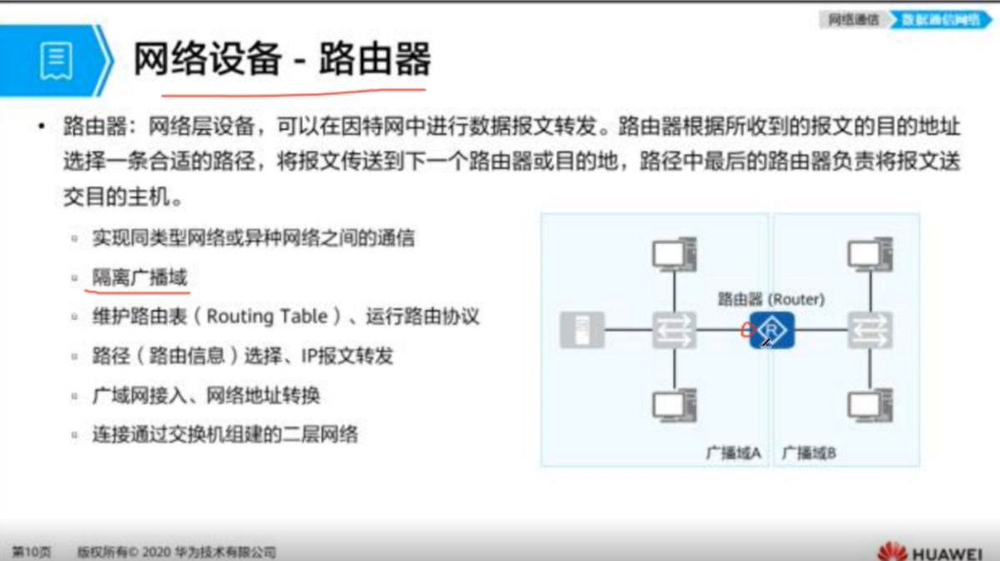

数据载荷：其实就是有用的信息，有用的数据载荷

报文：把有效载荷做了一层包装

头部：在数据载荷前面添加的信息段，相当于在外包装上面写寄件信息

尾部：在数据载荷后面添加的信息段，相当于校验值，用于表名身份这种。。

封装：给数据打包

解封装：拆数据包裹

网关：相当于邮件集散中心。数据的下一站点是哪，是由网关决定的，下一个站点在网络中叫**下一跳。**

路由器：网关是逻辑上的概念，路由器是设备上的概念。为数据报文选择路径。飞机火车自行车

终端设备：发送者，接收者，手机电脑这种。

## 网络设备-交换机

**交换机：**在小区内部进行通信，交换机就相当于社区管理员，负责内部信息交流。离终端最近的设备。

**广播域：**所有连在一台交换机上的pc都属于一个广播域。如果A要和B通信，喊一嗓子。其他广播域中的机器都能听到，

## 网络设备-路由器

数据要出小区，和外界通信则要通过路由器

隔离广播域：如果发现广播的数据，路由器会丢弃。

路由表，路由协议：邮递员有个地图，到哪坐哪趟车有个地图，这就是路由表，也叫路由图。这些路径是怎么形成的，是通过运行路由协议形成的。

路由器的一个接口就属于一个广播域，比如路由器连接了5个pc就有五个广播域，如果交换机连接五个pc，那就是一个广播域。

### 冲突域：

一个接口只能同时一个方向通信，如果两个方向就会产生冲突。

交换机的每一个接口，都是一个冲突域。

### **Hub：**已经淘汰了，软考还是会考

集线器，所有的端口都属于一个冲突域。

### 网桥：交换机就是多端口的网桥

所有接口属于广播域，每一个接口属于冲突域，因为他相当于端口比较小的交换机。

## 网络设备-防火墙

## 网络设备-无线设备

左边是家里的无线设备，右边是企业的无线设备。

企业中多了一个无线控制器AC，无线设备需要在AC下被管理，这时候就称之为无线瘦AP，而家里的可以自己管理称之为胖AP。

## 局域网、城域网、广域网（按照地理范围划分）

